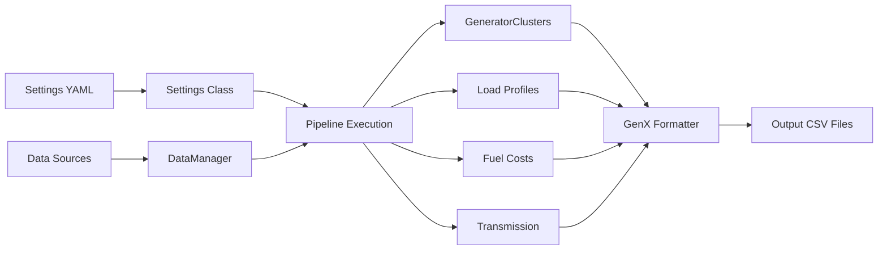
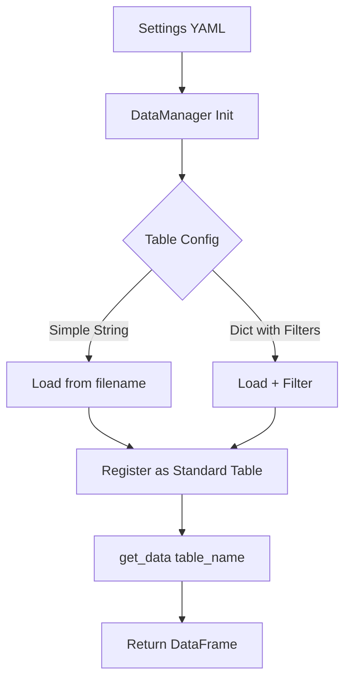
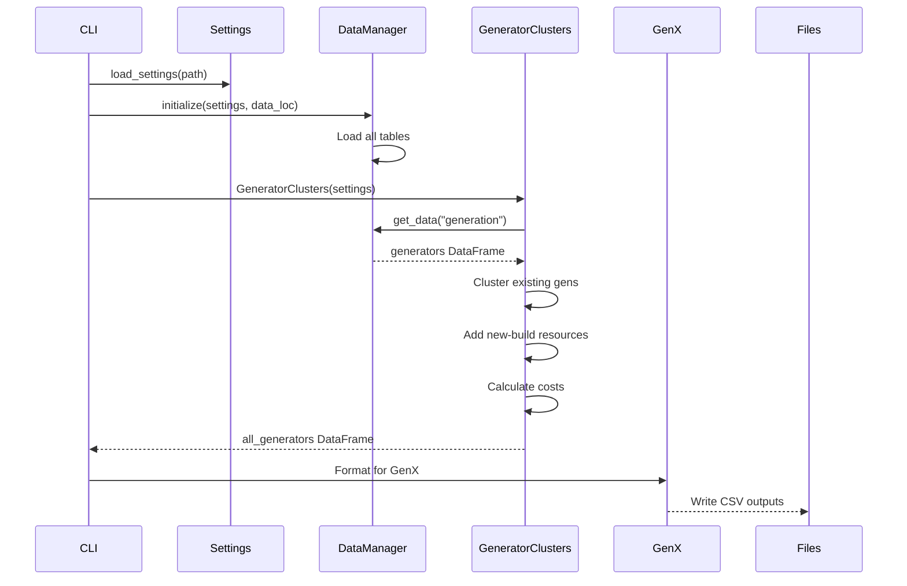
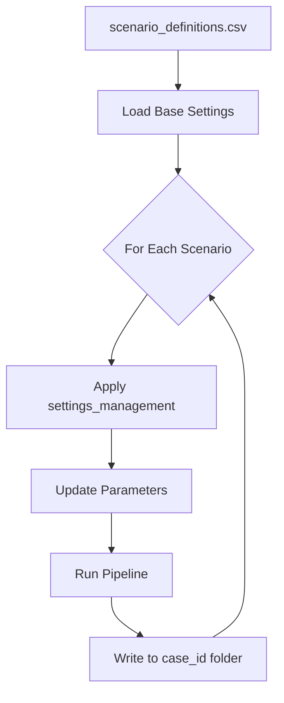

# Architecture Overview

This article explains PowerGenome's high-level architecture, key design patterns, and how components interact.

## System Design

PowerGenome is a **data pipeline** that transforms raw energy data into model-ready input files. It's not a simulation tool—it prepares inputs for capacity expansion models like GenX.

!!! abstract "Geographic Flexibility"
    While documentation examples reference US data sources (EIA, NREL ATB, PUDL databases), PowerGenome is **region-agnostic**. The pipeline accepts data tables from any geographic region—Europe, Asia, South America, etc.—as long as they follow the expected schemas. Replace US-specific inputs with your region's generation fleet, technology costs, demand data, and regional definitions.



## Core Components

### Settings Class

**Purpose**: Configuration management with frozen dictionary semantics

**Location**: `powergenome/settings.py`

**Key Features**:

- Loads and merges multiple YAML files
- Provides immutable configuration (frozen after loading)
- Supports multi-scenario parameter swapping
- Auto-fills function parameters via decorator

**Example**:

```python
from powergenome.settings import load_settings

# Load from folder
settings = load_settings(Path("settings"))

# Access with safety
model_regions = settings.get("model_regions", [])
target_year = settings["target_usd_year"]  # KeyError if missing
```

The `@auto_fill_settings()` decorator automatically injects settings:

```python
@auto_fill_settings(settings="SETTINGS")
def my_function(data, settings=None):
    # settings parameter auto-filled if not provided
    regions = settings["model_regions"]
```

### DataManager (Singleton)

**Purpose**: Centralized data access with in-memory DuckDB

**Location**: `powergenome/database.py`

**Key Features**:

- Singleton pattern (one instance per execution)
- Supports CSV, Parquet, and DuckDB sources
- Table configurations with DNF (Disjunctive Normal Form) filters
- Standardized table naming
- Automatic column snake_casing

**Data Flow**:



**Example Table Config**:

```yaml
# Simple
generation_table: "generators.csv"

# Advanced with filters
demand_table:
  table_name: demand_timeseries.parquet
  scenario: HighEV
  filters:
    - - [region, '=', 'CA']
      - [year, '>=', 2030]
```

**Usage**:

```python
from powergenome.database import get_data

# Get standardized table
generators = get_data("generation")
demand = get_data("demand")
```

### GeneratorClusters Class

**Purpose**: Main workflow orchestrator for generator data

**Location**: `powergenome/generators.py`

**Responsibilities**:

1. Cluster existing generators (k-means on heat rate/capacity)
2. Add new-build resources from technology cost data
3. Calculate costs (capex, O&M, fuel startup)
4. Assign fuels and emission factors
5. Apply regional cost multipliers
6. Configure renewable resource groups
7. Add distributed generation
8. Format for GenX output

**Example Workflow**:

```python
from powergenome.generators import GeneratorClusters

# Initialize with settings
gc = GeneratorClusters(settings)

# Main execution creates all generators
all_gens = gc.create_all_generators()

# Returns DataFrame with existing (clustered) + new-build resources
```

### GenX Formatter

**Purpose**: Format data for GenX model inputs

**Location**: `powergenome/GenX.py`

**Key Functions**:

- `network_line_loss()`: Transmission constraints
- `network_max_reinforcement()`: Expansion limits
- `energy_share_req()`: RPS/CES policy constraints
- `min_cap_req()`: Minimum capacity requirements
- Time reduction (clustering hours → representative periods)

## Design Patterns

### Frozen Settings Pattern

Settings are immutable after loading to prevent accidental modifications:

```python
settings = load_settings(path)
settings["new_key"] = "value"  # Raises TypeError

# Must create new instance
updated = settings.with_updates({"new_key": "value"})
```

### Singleton DataManager

Only one DataManager instance exists per run:

```python
from powergenome.database import initialize_data_manager, get_data

# Initialize once
initialize_data_manager(settings, data_location)

# Use anywhere
df = get_data("generation")  # Uses singleton instance
```

### Snake Case Normalization

All column names converted to snake_case:

```python
# Input: "Technology", "Existing Cap MW"
# After normalization: "technology", "existing_cap_mw"
```

This ensures consistent column access regardless of source data formatting.

### Auto-Fill Decorator

Dependency injection for settings parameter:

```python
@auto_fill_settings(settings="SETTINGS")
def process_data(data, settings=None):
    # If settings not provided, uses global/contextvar
    return transform(data, settings["param"])

# Can call with or without settings
result = process_data(my_data)
result = process_data(my_data, custom_settings)
```

## Data Flow

### Full Pipeline Execution



## Module Organization

### Core Pipeline

- **run_powergenome.py**: CLI entry point, orchestrates execution
- **settings.py**: Configuration management
- **database.py**: Data access layer

### Data Processing

- **generators.py**: Generator clustering and new-build
- **load_profiles.py**: Demand profile construction
- **fuels.py**: Fuel price time series
- **transmission.py**: Network constraints
- **resource_clusters.py**: Renewable site clustering

### Model-Specific

- **GenX.py**: GenX output formatting
- **time_reduction.py**: Representative period selection
- **financials.py**: Investment cost calculations

### Utilities

- **util.py**: Helper functions (snake_case, region mapping)
- **params.py**: Global parameters
- **external_data.py**: Policy scenarios, demand response

## Multi-Scenario Architecture

PowerGenome supports running multiple scenarios in one execution:



**Example scenario_definitions.csv**:

```csv
year,case_id,case_name,solar_cost,wind_cost
2030,baseline,Baseline,mid,mid
2030,high_re,High RE,low,low
2030,low_re,Low RE,high,high
```

Settings management swaps parameters:

```yaml
settings_management:
  2030:
    solar_cost:
      low:
        new_resources:
          - [UtilityPV, Class1, Advanced, 1]
      mid:
        new_resources:
          - [UtilityPV, Class1, Moderate, 1]
```

## Performance Considerations

### Memory Management

- DataManager holds all tables in memory (DuckDB)
- Large generation profiles can use significant RAM
- Tidy format profiles loaded with column projection (only needed columns)

### Computation Bottlenecks

- **K-means clustering**: O(n²) in worst case, but typically fast for 1000s of generators
- **Time reduction**: K-means on 8760 hours, multiple iterations
- **Profile aggregation**: Can be slow for many renewable sites

### Optimization Strategies

- Use table filters to load only needed data
- Cache renewable clusters (avoids re-clustering profiles)
- Reduce time domain aggressively (168 hours common)
- Use aggregated regions (fewer transmission constraints)

## Extension Points

PowerGenome is designed for extension:

1. **Custom technologies**: `additional_technologies_fn` for user-defined resources
2. **Custom fuels**: `user_fuel_price` with emission factors
3. **Custom data sources**: DataManager supports any CSV/Parquet/DuckDB
4. **Custom clustering**: Override `cluster_generators()` method
5. **Custom output formats**: Subclass GenX formatter for other models

## Related Documentation

- [Data Pipeline Flow](pipeline.md): Detailed execution sequence
- [DataManager](../how-to/configure-data-tables.md): Table configuration guide
- [Settings](../reference/settings/index.md): All configuration parameters
- [Generator Clustering](clustering.md): K-means methodology
