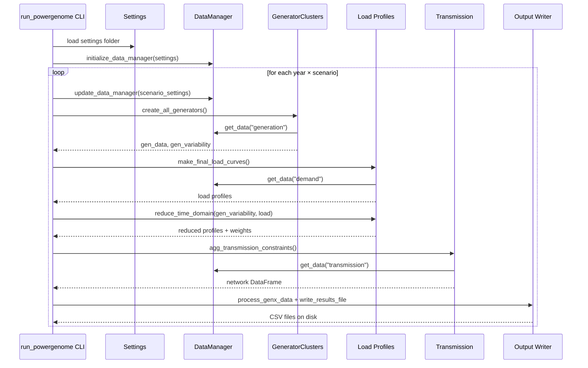

# Data Pipeline Flow

This page explains how PowerGenome transforms raw data into GenX input files — what happens at each stage, which components are involved, and how the pieces fit together.

For a higher-level overview of system components and design principles, see the [Architecture Overview](architecture.md).

---

## Overview

Running `run_powergenome` executes a linear pipeline that passes through six major stages for each planning period and scenario:

```
Settings → DataManager → Generator Clusters → Load Profiles → Transmission → Outputs
```

Multiple scenarios and planning years loop through stages 3–6 independently; settings and DataManager are initialized once and updated between iterations.

---

## Stage 1: Settings loading

```
run_powergenome --settings_file settings --results_folder results/
                          ↓
              Settings.load(settings_folder)
```

PowerGenome reads all YAML files from your settings folder, merging them into a single dictionary. Later files override earlier values; nested dictionaries are merged recursively; lists are replaced entirely.

If `scenario_definitions_fn` is present in settings, a scenario matrix is built from the CSV file. Otherwise, the pipeline creates one pass per planning period end year defined in `model_periods`.

**Key output**: a `Settings` object consumed by every downstream component.

---

## Stage 2: DataManager initialization

```
initialize_data_manager(settings, data_location)
```

DataManager is a **singleton** backed by an in-memory DuckDB database. It reads the table configuration keys from settings (e.g., `generation_table`, `demand_table`) and creates either in-memory tables or views pointing at CSV/Parquet files on disk.

Tables are addressed by standardized names (`generation`, `demand`, `fuel_prices`, etc.) regardless of how they are configured in settings.

At the start of each scenario, `update_data_manager()` is called to refresh filtered views for that scenario's settings.

**Key outputs**: standardized tables accessible to all modules via `DataManager.get_data(table_name)`.

---

## Stage 3: Generator clustering

```
GeneratorClusters.create_all_generators()
```

This stage builds the `Generators_data.csv` content and hourly generation variability profiles.

It has two parts that run in sequence:

### 3a. Existing generators

- Loads the `generation` table from DataManager
- Filters by model regions, operating year, and retirement age
- Groups plants by region and technology
- Applies k-means clustering (default: 1 cluster per region/tech group)
- Computes cluster-average heat rates, capacity, and costs
- Appends startup costs from EIA–ATB crosswalk

**Settings that control this step**: `num_clusters`, `alt_num_clusters`, `retirement_ages`, `tech_groups`, `generator_attributes_fn`

### 3b. New-build resources

- Reads ATB cost data for each technology listed in `new_resources`
- Applies `atb_modifiers` and `resource_modifiers` cost adjustments
- Adds `modified_new_resources` (user-defined variants)
- Builds renewable resource clusters from profile data (see [Configure Renewable Clusters](../how-to/configure-renewable-clusters.md))

**Settings that control this step**: `new_resources`, `atb_modifiers`, `resource_modifiers`, `renewable_clusters`

**Key outputs**: `gen_data` DataFrame and `gen_variability` hourly profiles (one column per resource).

---

## Stage 4: Load profile construction

```
make_final_load_curves()
```

- Loads the `demand` table from DataManager
- Applies regional load growth multipliers
- Subtracts distributed generation (rooftop solar) if configured
- Optionally adds demand response resources
- Returns an hourly DataFrame with one column per model region

**Then: time domain reduction**

```
reduce_time_domain(gen_variability, load)
```

If `reduce_time_domain: true`, k-means clustering selects `time_domain_periods` representative groups of days. Both the load and variability profiles are reduced to the representative periods, and a `Sub_Weights` column records how many hours each period represents.

If `reduce_time_domain` is not set or is `false`, all 8760 hours pass through unchanged as a single period.

**Key outputs**: `demand_data` (possibly reduced), `gen_variability` (possibly reduced), `time_series_mapping`.

---

## Stage 5: Transmission constraints

```
agg_transmission_constraints() → insert_tx_costs() → network_*()
```

- Loads the `transmission` table from DataManager
- Aggregates line capacities between model regions
- Adds line loss percentages and expansion cost parameters
- Builds the `Network.csv` content

Policy files (RPS, CO₂ caps, minimum/maximum capacity constraints) are also assembled in this stage from files referenced by `emission_policies_table` (legacy alias: `emission_policies_fn`), `energy_share_req_fn`, etc.

**Key outputs**: `network`, `esr`, `co2_cap`, `min_cap`, `max_cap`, `cap_reserves` DataFrames.

---

## Stage 6: Output formatting and writing

```
process_genx_data(case_folder, case_year_data)
write_results_file(dataframe, folder, filename)
```

`process_genx_data` assembles the DataFrames collected in prior stages into the GenX CSV schema. Column names are standardized (e.g., `capacity_mw` → `Existing_Cap_MW`), integer columns are cast, values are rounded, and resource tags are verified.

Files are written to a folder hierarchy:

```
results/
└── <case_id>/
    └── Inputs/
        └── Inputs_p<period>/
            ├── system/
            │   ├── Demand_data.csv
            │   ├── Fuels_data.csv
            │   ├── Generators_variability.csv
            │   └── Network.csv
            ├── resources/
            │   ├── Hydro.csv
            │   ├── Must_run.csv
            │   ├── Storage.csv
            │   ├── Thermal.csv
            │   ├── Vre.csv
            │   ├── Resource_multistage_data.csv
            │   └── policy_assignments/
            │       ├── Resource_capacity_reserve_margin.csv
            │       ├── Resource_energy_share_requirement.csv
            │       └── Resource_minimum_capacity_requirement.csv
            ├── policies/
            │   ├── Capacity_reserve_margin.csv
            │   └── Energy_share_requirement.csv
            └── extra_outputs/
                ├── existing_gen_units.csv
                └── *_site_cluster_assignments.csv
```

> **Note:** Not all files listed above will be present in every run — files for unused features (e.g., capacity reserve margins, multistage data) are omitted when the corresponding settings are not configured. Additional files may appear depending on enabled policies and options.

Resource files are split by technology type (`Thermal.csv`, `Vre.csv`, `Storage.csv`, etc.) rather than combined into a single `Generators_data.csv`. System-wide time-series files (`Demand_data.csv`, `Fuels_data.csv`, `Generators_variability.csv`, `Network.csv`) go into `system/`. Policy assignment files go into `resources/policy_assignments/`.

`powergenome_case_settings.yml` is written inside the `Inputs_p<period>/` folder, recording the exact settings used for that period.

---

## Full sequence diagram



---

## Execution flags

The `run_powergenome` CLI accepts flags to skip individual stages:

| Flag | Skips |
|---|---|
| `--no-current-gens` | Existing generator clustering only (new-build still runs) |
| `--no-gens` | The entire generator stage |
| `--no-load` | Load profile construction and time reduction |
| `--no-transmission` | Transmission constraints and policy files |

This is useful during development to iterate quickly on one part of the pipeline without waiting for the rest.

---

## Related documentation

- [Architecture Overview](architecture.md): System components and design decisions
- [CLI Reference](../reference/cli.md): All command-line flags
- [Settings Reference](../reference/settings/index.md): All configuration parameters
- [Configure Data Tables](../how-to/configure-data-tables.md): Setting up input data sources
